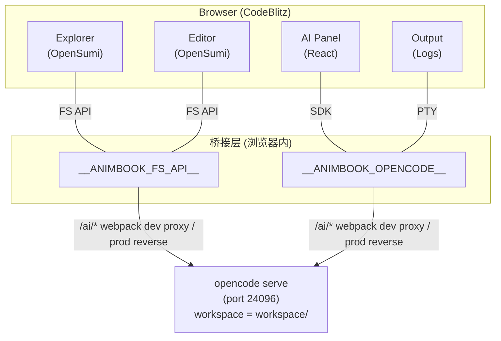

# animbook

可交互式阅读器：基于 CodeBlitz 的浏览器端 IDE，对接本地 opencode 服务做 AI 辅助、文件浏览、终端命令。


## 特性

- 浏览器内运行的 IDE：文件树、编辑器、终端、Tab 布局
- AI 助手面板（右侧）：对话、模型选择、Provider 管理（基于 opencode SDK）
- PDF 阅读器：双击 `.pdf` 文件直接在内置阅读器中打开（基于 pdfjs-dist），支持翻页、缩放、键盘导航
- 终端：集成 OpenCode PTY，直接连宿主 shell（工作区 = `workspace/`），平台感知（macOS/Linux → zsh/bash，Windows → PowerShell）
- 文件系统：读取、写、删、搜全在浏览器端完成（走 opencode 桥接），shell 命令按宿主系统自动选择（Windows 走 PowerShell）

## 技术栈

- **CodeBlitz 2.4.6** — IDE 容器、OpenSumi 兼容编辑器
- **OpenSumi 3.6.5** — 编辑器、终端、菜单等 IDE 核心
- **React 18 + TypeScript 5** — UI 框架
- **Webpack 5** — 打包 + 开发服务器
- **opencode (本地进程)** — AI 推理 + 文件系统 + PTY 后端
- **pdfjs-dist 4.10.38** — PDF 渲染

## 架构



**关键事实**：
- **纯前端项目**。后端只有一个 `opencode serve` 进程，不是 Node 后端。
- 后端 API 走 `/ai/*` → opencode 进程（dev 由 webpack 代理，prod 由反向代理）
- 工作区根目录从 `GET /ai/path`（Accept: application/json）的 `directory` 字段动态获取，**不硬编码**
- **平台感知**：`src/commands/platform.ts` 通过 `navigator.userAgentData` / UA 判断宿主系统（macOS/Linux/Windows），pty 与 FS 的 shell 命令、路径分隔符均按平台适配

## 目录

```
src/
├── App.tsx                  # 顶层组件, 启动前 fetch 工作区路径
├── index.tsx                # 入口: 实例化 SDK + 挂 FS API + 替换 window.confirm
├── commands/
│   ├── sandbox.ts            # opencode SDK 客户端
│   ├── fs.ts                 # FS API (read/write/PTY shell, 平台感知)
│   ├── platform.ts           # 平台判断 (UA/UA-CH) + shell/路径适配工具
│   └── terminal/             # 终端模块 (OpenCode PTY ↔ OpenSumi 终端)
├── config/
│   ├── runtime.ts            # OverlayFS + 同步钩子
│   ├── slots.ts              # 布局 (主区/侧栏/底部)
│   ├── layout.tsx            # 默认布局 (默认展开资源管理器)
│   └── preferences.ts        # 默认偏好
├── extensions/
│   ├── welcome/              # 欢迎页 (空工作区)
│   ├── pdf/                  # PDF 阅读器 (pdfjs-dist v4)
│   ├── binary/               # 二进制文件兜底 (非文本打开)
│   ├── html/                 # HTML 预览 (默认 webview, 可切文本)
│   ├── actions/              # 顶栏布局切换
│   └── chat/                 # 右侧 AI 面板
└── styles/
    ├── overrides.css         # OpenSumi 主题覆盖
    └── slots.css             # (未启用, 旧版)
```

## 开发

```bash
npm install
npm run dev
```

dev 模式并发启动两个服务：
- opencode 进程（端口 24096，cwd 是 `workspace/`）
- webpack dev server（端口 8090，代理 `/ai/*` 到 24096）

打开 http://localhost:8090/

**前置条件**：先安装 [opencode CLI](https://github.com/anomalyco/opencode)（`npm i -g opencode-ai`），dev 脚本会自动 `cd workspace && opencode serve`。

> **注意（Windows 用户）**：目前仅支持类 Unix 文件系统，暂未完全兼容 Windows 系统盘符（`C:\` 等）的路径处理。建议 Windows 用户使用 Docker 部署 opencode（[官方镜像说明](https://github.com/anomalyco/opencode)），将宿主机目录挂载进容器后，opencode 与浏览器工作区的路径统一走容器内路径。

## 生产构建

```bash
npm run build
# 输出到 dist/, 需要自己部署静态文件 + 反向代理 /ai/* → opencode
```

## AI 模型 / Provider

AI 面板里可以直接连接各种 Provider（OpenAI、Anthropic、OpenRouter、本地 ollama 等）。底层用 opencode 的 provider 系统（`~/.config/opencode/`），前端 UI 在 `src/extensions/chat/`。

## 标注 (Annotations)

PDF 阅读器会读取 PDF 内嵌标注（高亮/批注/链接/Widget）。预留事件钩子 `window.dispatchEvent('animbook:pdf-annotation-click', {detail: {filepath, annotation, page}})` 供后续插件监听。

## License

MIT（待定）

## 作者

魏祖潇 <https://github.com/weizuxiao911>
